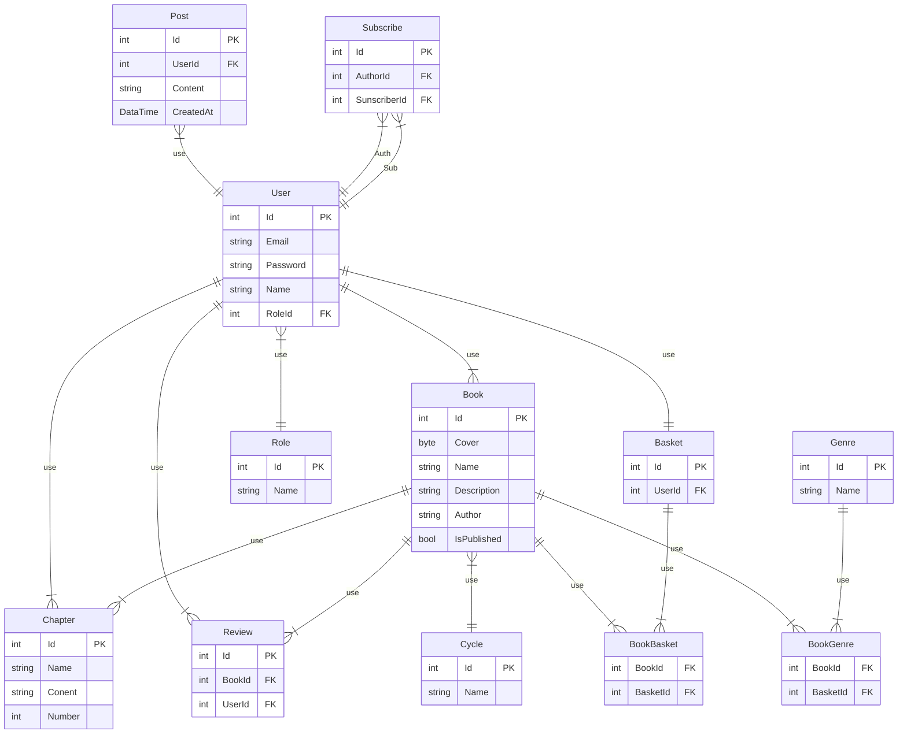

Основные функции:
- регистрация ВСЕ
- просмотр книг ВСЕ
- изменение в личном кабинете ВСЕ
- добавить/убрать книгу в/из избранного ВСЕ
- написать отзыв ВСЕ
- читать в читалке ВСЕ
- скачать pdf ВСЕ
- создать книгу (добавить цикл, жанры, название, обложка, описание, автор, опубликовать сразу/непубликовать, добавить главы !!!НА ДОБОВЛЕНИЕ ГЛАВ ДОЛЖНА БЫТЬ УДОБНАЯ DRAG&DROP ШТУКА, ЧТОБЫ МЕНЯТЬ МЕСТАМИ!!!) АВТОР
- опубликовать книгу АВТОР
- создать цикл (название, добавить книги* необяз.) АВТОР
- создать главу (название главы, описание встроенный редактор или из файла .md, можно сразу в книгу добавить можно это позже сделать) АВТОР
- создать жанр АДМИН
- редактировать жанр АДМИН
- Просмтаривать и редактировать все книги АДМИН МОЖЕТ ЗАХОДИТЬ ПОД ВСЕМИ АККАУНТАМИ
- Поиск, как по авторам, так и по книгам ВСЕ
- Фильтры к поиску ВСЕ

