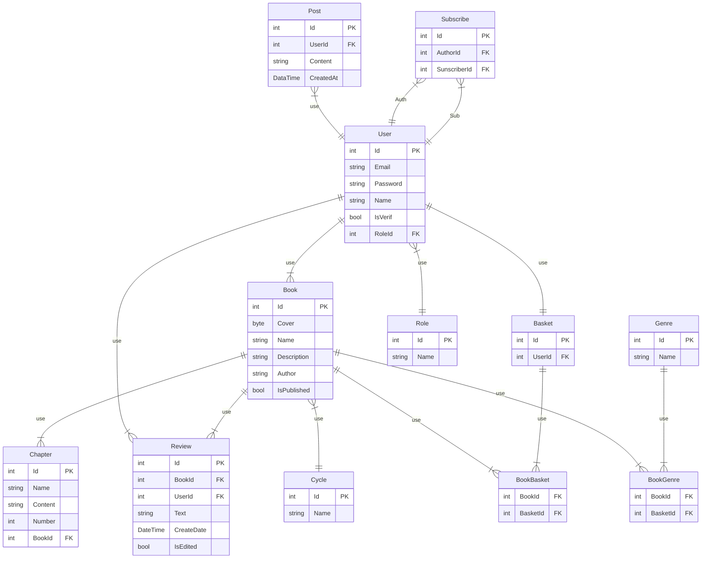

Îñíîâíûå ôóíêöèè:
- ðåãèñòðàöèÿ ÂÑÅ
- ïðîñìîòð êíèã ÂÑÅ
- èçìåíåíèå â ëè÷íîì êàáèíåòå ÂÑÅ
- äîáàâèòü/óáðàòü êíèãó â/èç èçáðàííîãî ÂÑÅ
- íàïèñàòü îòçûâ ÂÑÅ
- ÷èòàòü â ÷èòàëêå ÂÑÅ
- ñêà÷àòü pdf ÂÑÅ
- ñîçäàòü êíèãó (äîáàâèòü öèêë, æàíðû, íàçâàíèå, îáëîæêà, îïèñàíèå, àâòîð, îïóáëèêîâàòü ñðàçó/íåïóáëèêîâàòü, äîáàâèòü ãëàâû !!!ÍÀ ÄÎÁÎÂËÅÍÈÅ ÃËÀÂ ÄÎËÆÍÀ ÁÛÒÜ ÓÄÎÁÍÀß DRAG&DROP ØÒÓÊÀ, ×ÒÎÁÛ ÌÅÍßÒÜ ÌÅÑÒÀÌÈ!!!) ÀÂÒÎÐ
- îïóáëèêîâàòü êíèãó ÀÂÒÎÐ
- ñîçäàòü öèêë (íàçâàíèå, äîáàâèòü êíèãè* íåîáÿç.) ÀÂÒÎÐ
- ñîçäàòü ãëàâó (íàçâàíèå ãëàâû, îïèñàíèå âñòðîåííûé ðåäàêòîð èëè èç ôàéëà .md, ìîæíî ñðàçó â êíèãó äîáàâèòü ìîæíî ýòî ïîçæå ñäåëàòü) ÀÂÒÎÐ
- ñîçäàòü æàíð ÀÄÌÈÍ
- ðåäàêòèðîâàòü æàíð ÀÄÌÈÍ
- Ïðîñìòàðèâàòü è ðåäàêòèðîâàòü âñå êíèãè ÀÄÌÈÍ ÌÎÆÅÒ ÇÀÕÎÄÈÒÜ ÏÎÄ ÂÑÅÌÈ ÀÊÊÀÓÍÒÀÌÈ
- Ïîèñê, êàê ïî àâòîðàì, òàê è ïî êíèãàì ÂÑÅ
- Ôèëüòðû ê ïîèñêó ÂÑÅ
- ðåäàêòîð md
- ïîäòâåðæäåíèå ïî÷òû

